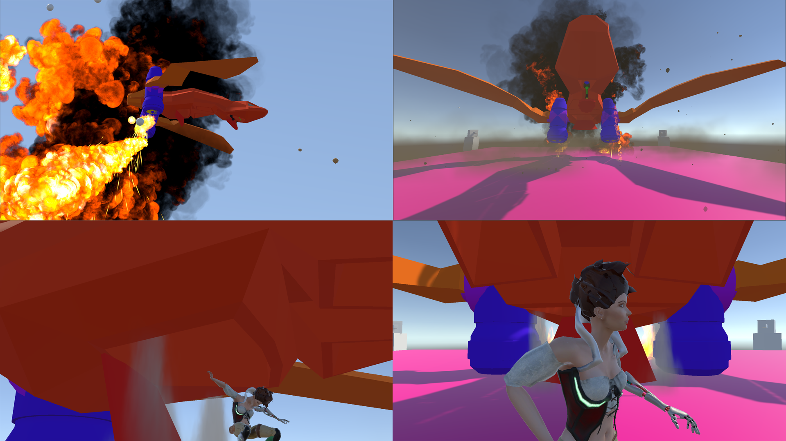

# UnityDemos

Series of Demos and Tutorials for students on various topics such as HDRP render pipeline, HDRi Environments, NavMesh agents, destructable environments, Scriptable Objects, Events Systems, RemoteSettings, character animation, usng LERP, etc.

Simple project templates for several genres such as basic horror game, twin-stick shooter etc.

Most projects are up-to-date to Unity version 2021.1.17f1

#HDRP Lighting Strategies (Needs to be update post 2020.2)

