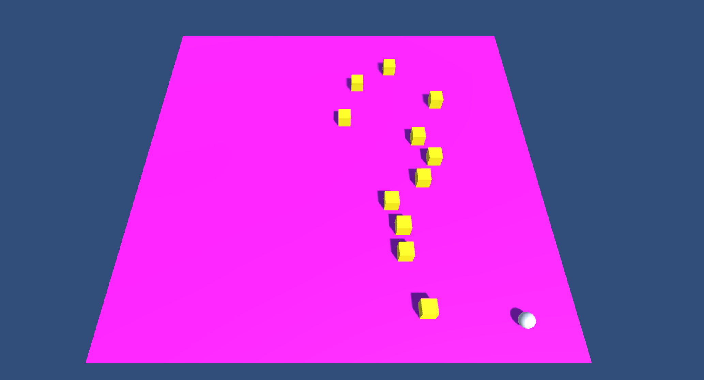

# UnityDemos

Series of Demos and Tutorials for students on various topics such as HDRP render pipeline, HDRi Environments, NavMesh agents, destructable environments, Scriptable Objects, Events Systems, RemoteSettings, character animation, usng LERP, etc.

Simple project templates for several genres such as basic horror game, twin-stick shooter etc.

Most projects are up-to-date to Unity version 2021.1.17f1

### HDRP Lighting Strategies (Needs to be update post 2020.2)
Projects demonstrates different lighting strategies (e.g. Realtime, Baked, GI) and their expected performance metrics.

### Starter Files for a simple Twin-Stick Shooter Project
Contains everything students need to get going such as basic player movement, nav mesh enemies, score system, health system, etc.

### Starter Files for a simple Horror Game Project
Contains everything students need to get going such as character controller, flashlight controller, event scripting examples (i.e. jump scares), collectables, etc.

### Cinemachine Setup Example
Project Demonstrates how to setup cinemachine and control animations, particle systems, audio, etc.

### NavMesh Demo
Demonstrates how to setup NavMesh and how to define agent settings, obstacles, offMesh links, weighted paths, etc.

### Scriptable Event System Demo
Demonstrates how to setup a scriptable event system to control the game state and gameplay events. Based on the following Unity blog post: https://unity.com/how-to/architect-game-code-scriptable-objects

### LerpingWithCode Demo
Demonstrates how to lerp an object with code. Covers different smooting/easing functions, how to warp and how to Yoyo, and how to implement custom animation curves all via code without the animator. 

### Mixamo Demo
Simple workshop demonstrating how to import character animation from a library such as Mixamo and apply it to the player character. 

### Cheaty Destructable Objects
How to setup simple destructable objects using a pre-factured mesh in Maya. 

